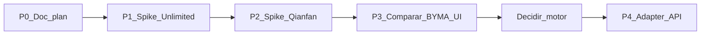

# v2 — Plan Baidu VLM (Unlimited-OCR + Qianfan-OCR)

Documento de roadmap para la **v2** de LexOCR.  
**Estado:** planificación / investigación. **No** cambia el pipeline v1 (PP-OCRv6 medium).

Hechos técnicos citados solo desde documentación oficial y dumps Parallel en [`research/`](research/). No inventar APIs, VRAM, límites ni formatos.

## 1. Contexto studio

| Versión | Motor | Notas |
|---------|--------|--------|
| **v1** (cerrada) | PP-OCRv6 medium + rescate angular | Regiones espaciales: `Region` con `bbox` / `poly` / `confidence` ([`frontend/src/types/ocr.ts`](../frontend/src/types/ocr.ts)); parse vía `dt_polys` ([`backend/app/parsing.py`](../backend/app/parsing.py)). Ver [PRODUCT.md](PRODUCT.md). |
| **v2** (próxima) | VLM | Fin de exprimir det+rec clásico. Este doc evalúa **dos** candidatos Baidu HF. |

**Fuera de alcance de este documento:** implementar integración en FastAPI/UI; elegir PaddleOCR-VL / HPD (investigación previa aparte).

## 2. Candidate A — Unlimited-OCR

### Fuentes oficiales

- Model card: [baidu/Unlimited-OCR](https://huggingface.co/baidu/Unlimited-OCR)
- README: [github.com/baidu/Unlimited-OCR](https://github.com/baidu/Unlimited-OCR/blob/main/README.md)
- Receta vLLM: [recipes.vllm.ai/baidu/Unlimited-OCR](https://recipes.vllm.ai/baidu/Unlimited-OCR)
- Paper: [arXiv 2606.23050](https://arxiv.org/abs/2606.23050) · [HTML](https://arxiv.org/html/2606.23050)
- Dump Parallel: [`research/docs-research-unlimited-ocr-extract.json`](research/docs-research-unlimited-ocr-extract.json), [`research/docs-research-unlimited-ocr-vllm-arxiv.json`](research/docs-research-unlimited-ocr-vllm-arxiv.json)

### Hechos documentados

| Tema | Valor oficial |
|------|----------------|
| Licencia | MIT |
| Tamaño | ~3B params, BF16 (card) |
| Tipo | Image-Text-to-Text; document parsing → Markdown |
| Single image | Modes **gundam** (`base_size=1024`, `image_size=640`, `crop_mode=True`) o **base** (`image_size=1024`, `crop_mode=False`); prompt `'<image>document parsing.'` |
| Multi / PDF | **Solo base**; `infer_multi`; prompt `'<image>Multi page parsing.'`; PDF = PyMuPDF `pdf_to_images(..., dpi=300)` luego multi |
| N-gram | `no_repeat_ngram_size=35`; `ngram_window=128` (single) / `1024` (multi); `max_length=32768` |
| vLLM | GPU **≥8 GB VRAM** BF16; imagen `vllm/vllm-openai:unlimited-ocr`; logits processor `NGramPerReqLogitsProcessor`; `skip_special_tokens=False`; prompt con literal `<image>` |
| Salida | Tokens `<\|ref\|>…<\|\ref\|>` / `<\|det\|>…<\|\det\|>`; post-proceso oficial `DET_RE` / `remove_det` para Markdown limpio |
| Arquitectura | R-SWA (Reference Sliding Window Attention): KV decode acotado; one-shot multipágina |
| Benchmark (paper) | OmniDocBench v1.6 e2e overall **93.92%** citado |
| Límite (paper §7) | Prefill / contexto finito (p. ej. 32K); no “ilimitado” bajo contexto finito |

### Encaje studio

- **Fuerte** para Markdown de docs largos (p. ej. BYMA multipágina) en un solo pase.
- **Débil** respecto al contrato v1 `Region[]` + `confidence`: el grounding oficial es `<|det|>`, no `dt_polys` de PaddleOCR.

## 3. Candidate B — Qianfan-OCR

### Fuentes oficiales

- Model card: [baidu/Qianfan-OCR](https://huggingface.co/baidu/Qianfan-OCR)
- Paper: [arXiv 2603.13398](https://arxiv.org/abs/2603.13398)
- Familia / anuncio: [baidubce/Qianfan-VL](https://github.com/baidubce/Qianfan-VL)
- Skill: [qianfanocr-document-intelligence](https://github.com/baidubce/skills/tree/develop/skills/qianfanocr-document-intelligence)
- Dump Parallel: [`research/docs-research-qianfan-ocr-extract.json`](research/docs-research-qianfan-ocr-extract.json)

### Hechos documentados

| Tema | Valor oficial |
|------|----------------|
| Licencia | Apache-2.0 (card) |
| Tamaño | Card: **5B** params BF16; paper/abstract: **4B** |
| Rol | End-to-end document intelligence (parse + layout + understanding) |
| Tareas (card) | Image→Markdown; multi-page; JSON/HTML; layout; tablas HTML; fórmulas LaTeX; charts; KIE; handwriting; scene OCR; **192** idiomas |
| Layout-as-Thought | `enable_thinking=True` en `apply_chat_template` → bounding boxes + tipos de elemento + reading order **antes** del output final |
| Cuándo thinking | Activar en layouts heterogéneos; desactivar en docs homogéneos (mejor resultado / menor latencia, según card) |
| Prompts | `"Parse this document to Markdown."`; KIE con prompt de campos → JSON |
| vLLM | `vllm serve baidu/Qianfan-OCR --trust-remote-code --hf-overrides '{"architectures": ["InternVLChatModel"]}'` |
| Benchmarks (card) | OmniDocBench v1.5 e2e **93.12**; OlmOCR **79.8**; KIE avg **87.9**; ~**1.024 PPS** W8A8 en A100 (vLLM 0.10.2) |

### Encaje studio

- Más cercano a la **UI espacial** y a `reading_order` si se parsea el thinking.
- Markdown / export LLM-ready directo por prompt.
- No documenta un score de confianza por región al estilo PP-OCR.

## 4. Gap analysis vs contrato v1

| Necesidad studio | Unlimited-OCR (oficial) | Qianfan-OCR (oficial) |
|------------------|-------------------------|------------------------|
| Markdown LLM-ready | Sí (post `remove_det`) | Sí (`Parse this document to Markdown.`) |
| Boxes espaciales editables | `<|det|>` + coords (paper: coords normalizadas 0–1000 en training) | Layout-as-Thought: boxes + tipos + order |
| Confidence por región | No documentado como score PP-OCR | No documentado como score PP-OCR |
| PDF multipágina | Raster PyMuPDF + one-shot multi | Multi-page parsing (prompt / skill PDF) |
| GPU | ≥8 GB VRAM (receta vLLM) | Benchmarks en A100; VRAM mínima no fijada en card |

**Implicación:** v2 necesitará un **contrato de resultado VLM** (o capa de mapeo), no reutilizar ciegamente `OCRResult.regions` del det+rec v1.

## 5. Fases de mejora

Orden fijo. **Esta entrega = solo P0 (docs).** Spikes posteriores no se ejecutan hasta decidirlo explícitamente.

### P0 — Documentación (hecho en este trabajo)

- Este archivo + índice en [`README.md`](README.md) + puntero en [`PRODUCT.md`](PRODUCT.md).
- Dumps Parallel bajo [`research/`](research/).

### P1 — Spike offline Unlimited-OCR

Fuera del FastAPI v1:

1. Transformers (README) **o** Docker `vllm/vllm-openai:unlimited-ocr` (receta oficial).
2. 1 página: mode gundam + prompt document parsing.
3. PDF BYMA: `pdf_to_images` dpi=300 → `infer_multi` / base / `ngram_window=1024`.
4. Guardar MD crudo + post `remove_det`; anotar latencia/VRAM **medidos** (no inventados).

### P2 — Spike offline Qianfan-OCR

1. Transformers: misma página compleja con `enable_thinking` on/off.
2. Prompt Markdown; opcional KIE.
3. Capturar salida thinking vs final (boxes / order vs MD).

### P3 — Criterios go / no-go

Checklist antes de elegir motor:

- [ ] Calidad Markdown en BYMA vs export v1.
- [ ] ¿Se pueden mapear boxes a overlay usable en el studio?
- [ ] Coste GPU / latencia aceptable en la máquina objetivo.
- [ ] Licencia OK (MIT / Apache-2.0).

### P4 — Diseño adapter (futuro, post-evidencia)

- Endpoint VLM separado; pipeline PP-OCRv6 v1 intacto.
- No mezclar rescate angular det+rec con salida VLM.
- Nuevo schema de resultado (MD + layout opcional), distinto de `Region.confidence` clásico.

## 6. No-goals

- No modificar `backend/app/ocr.py` ni rutas v1 en P0.
- No afirmar soporte Windows nativo si la doc oficial solo describe NVIDIA CUDA / Docker / A100.
- No afirmar que `<|det|>` ≡ `dt_polys` ni que Layout-as-Thought ≡ `Region.confidence`.
- No elegir motor definitivo sin spikes P1–P2.

## 7. Fuentes y research dumps

### URLs oficiales

- [baidu org HF](https://huggingface.co/baidu)
- [Unlimited-OCR HF](https://huggingface.co/baidu/Unlimited-OCR)
- [Unlimited-OCR GitHub README](https://github.com/baidu/Unlimited-OCR/blob/main/README.md)
- [vLLM recipe Unlimited-OCR](https://recipes.vllm.ai/baidu/Unlimited-OCR)
- [arXiv Unlimited OCR Works](https://arxiv.org/abs/2606.23050)
- [Qianfan-OCR HF](https://huggingface.co/baidu/Qianfan-OCR)
- [arXiv Qianfan-OCR](https://arxiv.org/abs/2603.13398)
- [Qianfan-VL GitHub](https://github.com/baidubce/Qianfan-VL)
- [Qianfan OCR skill](https://github.com/baidubce/skills/tree/develop/skills/qianfanocr-document-intelligence)

### Dumps Parallel (`docs/research/`)

| Archivo | Contenido |
|---------|-----------|
| [`baidu-hf-informe.json`](research/baidu-hf-informe.json) | Síntesis utilidad org baidu HF |
| [`baidu-hf-search.json`](research/baidu-hf-search.json) | Search Parallel |
| [`baidu-hf-extract.json`](research/baidu-hf-extract.json) | Extract org + cards |
| [`baidu-hf-org-catalog.json`](research/baidu-hf-org-catalog.json) | Spaces / catálogo |
| [`docs-research-unlimited-ocr-extract.json`](research/docs-research-unlimited-ocr-extract.json) | Extract oficial Unlimited |
| [`docs-research-unlimited-ocr-vllm-arxiv.json`](research/docs-research-unlimited-ocr-vllm-arxiv.json) | vLLM + paper Unlimited |
| [`docs-research-qianfan-ocr-extract.json`](research/docs-research-qianfan-ocr-extract.json) | Extract oficial Qianfan |
