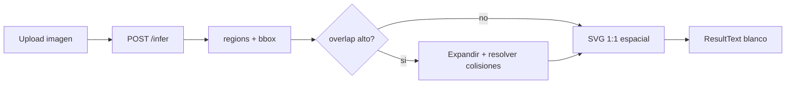

> **Estado (2026-07-29):** AVIF y ResultText SVG espacial ya están en código. `inflateIfCrowded` se cancela a favor de ajustar `text_det_unclip_ratio` (API oficial PaddleOCR 3.x) desde InferOptions/UI.

# Plan: ResultText espacial + nube inflada + AVIF

## Objetivo visual

Dos paneles lado a lado:

- **Input Image**: foto original + bounding boxes (ya funciona).
- **ResultText**: lienzo blanco con cada palabra en su posici├│n relativa, texto legible, borde de color y confianza. Si hay mucha superposici├│n (nube), **inflar** las cajas para que no se pisen.



## 1. Soporte AVIF ÔÇö [backend/main.py](../backend/main.py)

Agregar `avif` en estos puntos (hoy se rechaza antes de Pillow):

- `ALLOWED_MIME`: `"image/avif"`
- `ALLOWED_EXT`: `"avif"`
- `mime_map` en `_detect_format`
- Detecci├│n magic (como WEBP): `data[4:8] == b"ftyp"` y `data[8:12] in (b"avif", b"avis")`
- Set `kind not in {...}` dentro de `upload()`

Si Pillow no decodifica AVIF al normalizar, agregar `pillow-avif-plugin` a [backend/requirements.txt](../backend/requirements.txt) e instalarlo en el venv.

Frontend en [frontend/src/App.tsx](../frontend/src/App.tsx): sumar `avif` a `ACCEPTED_EXT`, `BROWSER_PREVIEW_EXT` y al `accept` del input.

## 2. Reescribir ResultText como SVG ÔÇö [frontend/src/App.tsx](../frontend/src/App.tsx)

Reemplazar el bloque actual de `div` absolutos (l├¡neas ~763ÔÇô805) por:

```tsx
<svg viewBox={`0 0 ${canvasW} ${canvasH}`} className="w-full bg-white">
  {layoutRegions.map((r) => (
    <>
      <rect ... stroke={color} fill="none" />
      <text fontSize={r.bbox.height * 0.85}
            textLength={r.bbox.width}
            lengthAdjust="spacingAndGlyphs">
        {r.text}
      </text>
      {/* confianza peque├▒a arriba a la derecha de la caja */}
    </>
  ))}
</svg>
```

Cambios clave vs. hoy:

- Sin `Math.max(..., 5%)` que infla cajas chicas artificialmente.
- `fontSize` derivado de `bbox.height` (escala con cada palabra).
- Confianza **fuera** del texto (label peque├▒o), no dentro de la caja compitiendo por espacio.
- Hover sincronizado con el panel izquierdo / Input Image (ya existe `hoveredRegion`).

## 3. Inflación automática de nubes

Nueva funci├│n pura en el frontend (mismo archivo o helper corto al inicio de `App.tsx`):

`layoutRegions = inflateIfCrowded(regions, imgW, imgH)`

**Detecci├│n de ÔÇ£nubeÔÇØ:** si el ratio de pares de cajas que se solapan supera un umbral (~15ÔÇô20%), o si `regions_count >= 25` y hay solapes, activar inflaci├│n.

**Algoritmo (concreto):**

1. Calcular centroide de todas las cajas.
2. Expandir cada centro desde el centroide por factor `~1.35ÔÇô1.6` (mantienen tama├▒o, solo se alejan).
3. Iterar 20ÔÇô40 pasos: si dos cajas se solapan (con padding m├¡nimo de ~4ÔÇô8 px), empujarlas en la direcci├│n del vector entre centros.
4. Trasladar el conjunto al origen positivo y agrandar `canvasW` / `canvasH` para que nada se corte.
5. Si no hay solape significativo ÔåÆ devolver regiones originales y canvas = tama├▒o de imagen.

Documentos ÔÇ£limpiosÔÇØ (etiqueta, factura) no se tocan. Nubes (`imagen 2`, `imagen 3`) quedan legibles sin pasar a lista.

## 4. Verificaci├│n e2e

Con backend en `:8100`:

| Archivo | Esperado |
|---------|----------|
| `imagenes_prueba/imagen 1.avif` | upload OK + infer con regiones |
| `imagenes_prueba/imagen 2.jpeg` | ResultText inflado, palabras legibles |
| `imagenes_prueba/imagen 3.jpeg` | ResultText inflado o espacial seg├║n solape |

Tambi├®n: `npm run build` sin errores TS.

## Fuera de alcance

- No cambiar m├®tricas (ya est├ín OK).
- No cambiar el motor PaddleOCR ni el contrato de `/infer`.
- No convertir Resultados en lista de tarjetas (el usuario quiere layout espacial).
